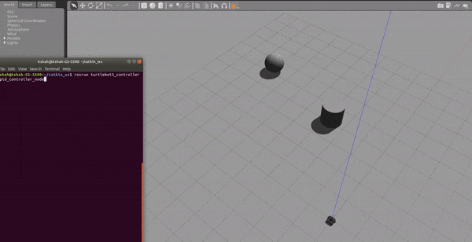

# Turtlebot3_ControllerROS
The repository contains my implementations for turtlebot3 controllers written in C++ for Turtlebot3 in ROS 

The controller(s) work for ROS Kinetic, ROS Melodic & ROS Neotic

Turtlebot3- PID_Controller

## Installation 

Open your terminal and follow the following steps

Go into your catkin_ws (or any ROS workspace) or create one if you do not have one

        mkdir -p catkin_ws/src/
        catkin_init_workspace

Clone the repository in src folder of your catkin_ws

        git clone https://github.com/KavitShah1998/Turtlebot3_ControllerROS

Build and source your catkin_ws

        catkin_make
        source ./devel/setup.bash 

## Running

Open a new terminal, source it and launch any turtlebot3_world (Make sure you have turtlebot3 packages installed on your system)

        roslaunch turtlebot3_gazebo turtlebot3_empty_world.launch

Once Gazebo starts running, open another terminal, enter ito your catkin_ws, source it and run the turtlebot3 controller executable 

        cd catkin_ws/
        source ./devel/setup.bash
        rosrun turtlebot3_controller controller_node

## Future Tasks

* On-Hardware implementation of point-2-point controller & trajectory tracking controller on turtlebot

* Implementation of MPC Controller on simulation and hardware

Stay Tuned for more exciting updates to the package.

Thanks for visiting.

